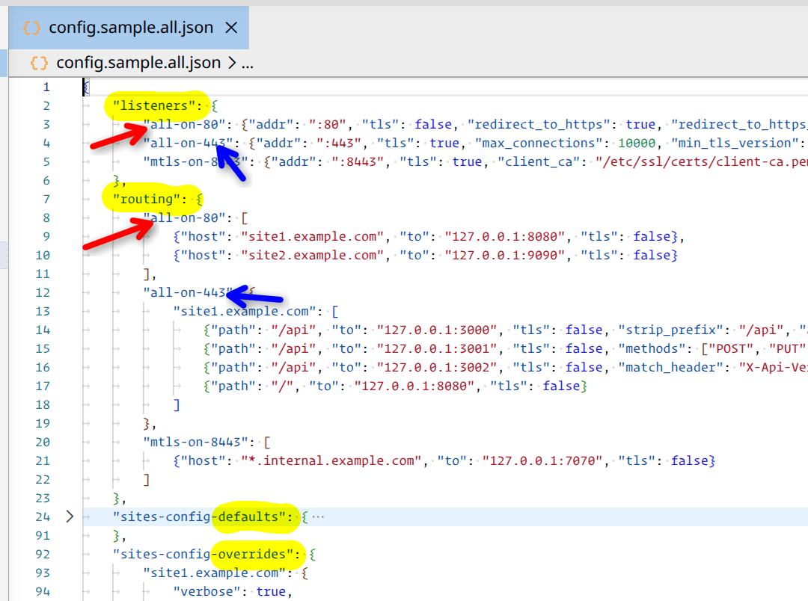

# what
- light and robust HTTP router with zero third party dependencies, binary is 12MB or 6.5MB compressed
- terminates TLS with Let's Encrypt over ACME + auto-renews certificates
	- OR terminates TLS with custom cert if auto-renew is not wanted
	- OR supports mTLS if set
- forwards requests to upstream services based on the incoming host/path + allows overrides
- serves "Under Maintenance" page when upstream service is unavailable

# config
- to start fast, just use some of the `config.sample.*.json` files closest to your case
- most probably just copy [config.sample.all.json](./config.sample.all.json) to `config.json` and remove what you don't need
- ports `80` and `443` must be reachable for normal ACME validation and HTTPS traffic to work
- for complete options possible either look at the [config.sample.all.json](./config.sample.all.json) or [readme-config.md](./readme-config.md)
- how to read
	- open `config.sample.all.json`
	- it has everything, diagonal-read it to spot the logic
	- it should be easy to pick-up:  listeners, routers, defaults and per site overrides

# run - prod
- `simple-http-server-proxy -config config.json`
- edit + reload config
	- by PID: `kill -HUP $(pidof simple-http-router)`
	- by PID: `kill -HUP 12345`
	- `systemctl reload simple-http-router`
	- reload updates: routing, upstreams, timeouts, and all per-site config
		- listener and TLS changes still require a full restart

# enable staging to debug cert auto-renew
- set `sites-config-defaults/use_staging -> true`
	- makes ACME certificate requests go to Let's Encrypt's staging server `https://acme-staging-v02.api.letsencrypt.org/directory`
	- staging issues certificates that browsers don't trust, but it has much higher rate limits
	- use it to test that your ACME setup works (config, DNS, ports, permissions) without burning through Let's Encrypt's production rate limits (50 certs per domain per week).

# status
- as of 2026-04-11
	- perf was not tested against any of the bellow
	- features that makes this a bloat are left out for separate components on purpose, see [vs-caddy](#vs-caddy) and [readme-design](./readme-design.md)
	- logging is to STDOUT, no files or multi-output, to be updated

# vs-caddy (to be updated)
- sysadmin stuff
	- metrics is a concern of another component, coding this in makes it complex
		- metrics is sent out
	- logging is a concern of another component, coding this in makes it complex
		- the logging is sent out, multi-storage, rotation, etc is left for the said component
	- load balancing is a concern of another component, coding this in makes it complex
		- this includes - Health checks - periodic background probes to upstreams, auto-remove unhealthy backends before traffic hits them
	- amdin API is a concern of another component, coding this in makes it complex
		- another tool will automate the management of this server
		- REST endpoint for pushing config, inspecting state, triggering reloads without SIGHUP
	- IP allow/blocklist is a concern of another component, coding this in makes it complex

- functions
	- Static file serving - is a concern of another component, coding this in makes it complex
		- Built-in file server with MIME types, directory listings, index files, range requests
	- Retry on upstream failure - is a concern for the load balancing
		- Try next backend before returning error page
	- Response caching	Cache upstream responses with TTL, conditional requests
	- Plugin/module system	Extend without modifying core - TODO

- protocol support
	- HTTP/3 (QUIC) - TODO
		- UDP-based transport, enabled by default
	- WebSocket - passes upgrades through (Caddy handles it explicitly with timeouts, buffering, and upgrade detection)
	- gRPC - works for gRPC over h2, but no h2c (cleartext HTTP/2) (Caddy handles gRPC with h2c and trailer support)
		- gRPC h2c - Cleartext HTTP/2 for backend gRPC connections

# where it stands (to be updated)
tool						| strength						| Complexity
----						|----							|----
Caddy						| Simplicity, HTTPS auto		| Easy
NGINX						| Flexibility, ecosystem		| Medium
HAProxy						| Performance, load balancing	| Medium
Envoy						| Microservices, gRPC			| Complex
Traefik						| Dynamic config				| Easy
Apache						| Legacy, modules				| Medium
simple-http-router			| Simplicity, HTTPS auto		| Easy

- NGINX
	- Industry standard for years
	- Very fast, battle-tested
	- Huge ecosystem
	- Config can get complex
	- Best for: traditional setups, high traffic, fine control

- Apache HTTP Server
	- Older but extremely flexible
	- Tons of modules (mod_proxy, etc.)
	- Heavier than modern alternatives
	- Best for: legacy systems, compatibility

- HAProxy
	- Focused on load balancing
	- Extremely performant (L4 + L7)
	- Not as “web server-ish”
	- Best for: high-scale load balancing, reliability

- Envoy
	- Built for microservices
	- Deep HTTP/2, gRPC support
	- Core of service meshes
	- Best for: Kubernetes, service mesh, gRPC-heavy systems

- Traefik
	- Auto-config via Docker/Kubernetes
	- Dynamic routing (no reloads)
	- Very dev-friendly
	- Best for: containers, dynamic environments

- Nginx Unit
	- Dynamic config via API
	- App server + proxy hybrid

- H2O
	- Designed for HTTP/2 performance
	- Lightweight, less common

- OpenResty
	- NGINX + Lua scripting
	- Highly programmable proxy

> tldr
> - Want simple + modern → Caddy or Traefik
> - Want control + maturity → NGINX
> - Want extreme scale LB → HAProxy
> - Want service mesh / gRPC infra → Envoy

